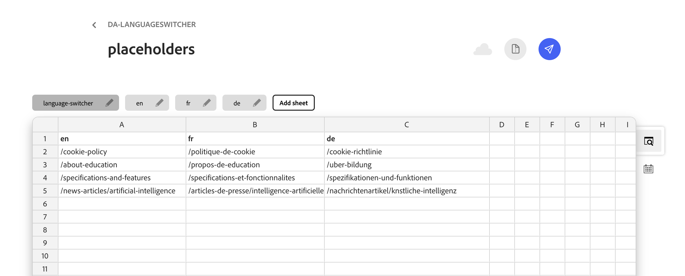
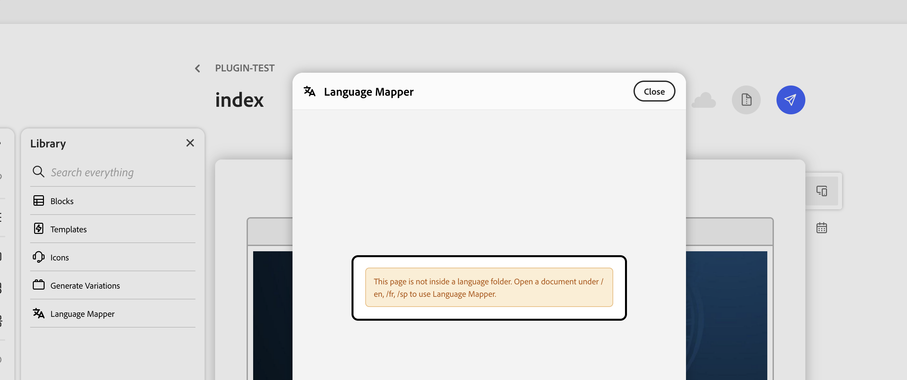
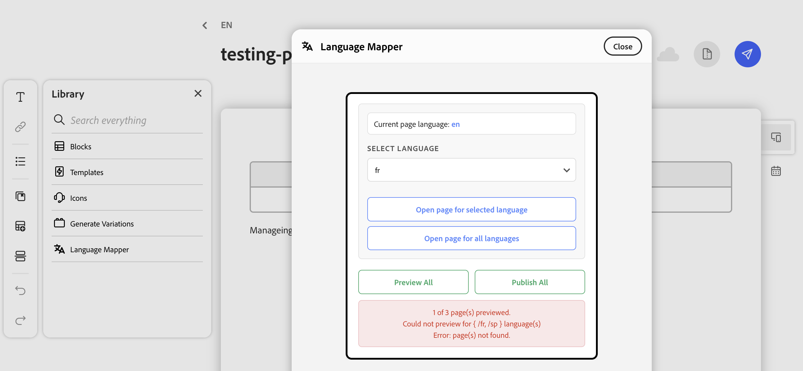
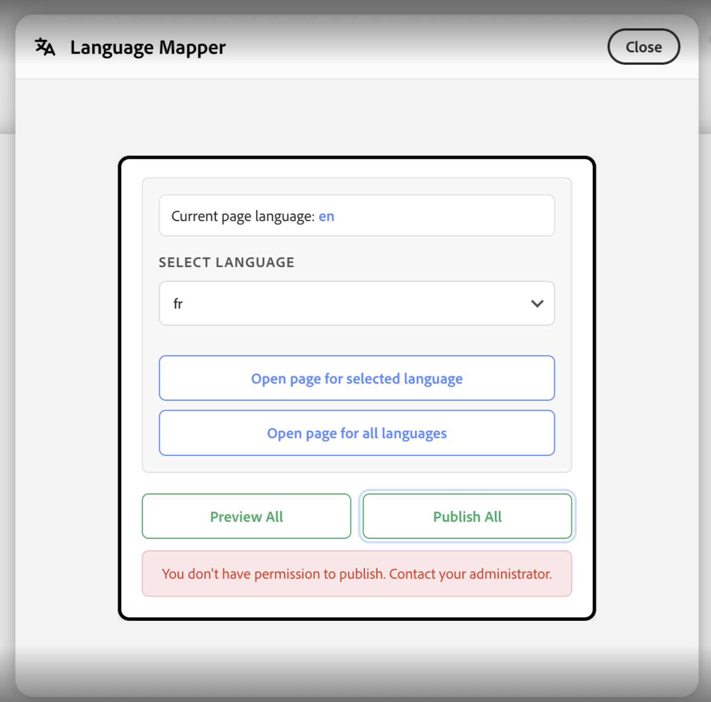

# Language Switcher

A Document Authoring (DA) **library plugin** that helps authors jump to the same page in other locales and run bulk **preview** / **publish** for every language defined in **`placeholders.json`**.

## Overview
Language Switcher is for same-page, different-language navigation. It helps authors jump to the equivalent 
path for the document they are editing.

## Features

1. **Automatic Locale Detection**
  * Detects the current language (like en, fr) directly from the page URL.
    This helps the plugin understand which version of the page you’re currently on.

2. **Smart Path Resolution**
  * Matches the current page path with entries in placeholders.json.
    Finds the correct equivalent page in the selected language automatically.

3. **Language Picker UI**
  * Provides a dropdown where users can select the target language. 
    Makes switching languages easy without editing URLs manually.

4. **Open Selected/All Languages**
  * Selected Language Page: Opens the same page in the language chosen by the user.
    All Language Pages: Opens all available language versions of the current page at once.

5. **Preview/Publish All Language Pages**
  * Allows users to preview/publish all available versions of the current page in a single action.
  The plugin validates each page and displays corresponding results such as successful preview/publish, 404 page not found, unauthorized access and other errors.

6. **Intelligent Fallback Navigation**
  If no mapping is found in `placeholders.json`, the plugin falls back to updating only the locale in the URL while preserving the existing page path.


## How to Use

1. Add the plugin under `tools/languageswitcher/` (`languageswitcher.html`, `languageswitcher.js`, `languageswitcher.css`, `placeholders.js`, `locale-url-helper.js`, `aem-admin.js`, `da-permissions.js` optional `icons/`).

2. A published **`placeholders.json`** in repo that includes a **`language-switcher`** sheet. Example:



3. Open the page you want to switch from (any supported language) in DA
4. Open DA Language Switcher from the Library. 
5. Choose a language if the dropdown appears(for more than 2 languages). Choose one of the available actions:
  a) Open Page for Selected Language → Opens the equivalent page in the chosen language
  b) Open Page for All Languages → Opens all available localized versions of the current page
* For 2 languages the plugin directly displays the alternate language option instead of showing a dropdown.
6. Preview All/ Publish All Language Pages → Triggers preview/publish for all localized pages and displays status/results for each language page.

## File Overview

```
tools/languageswitcher/
├── languageswitcher.html   # UI layout (entry point)
├── languageswitcher.js     # Core logic (UI + navigation handling)
├── languageswitcher.css    # Layout and styling
├── placeholders.js         # Fetch placeholders.json, Implements the core language resolution logic.
├── locale-url-helper.js    # Shared utilities (DA / preview URL builders, helpers)
├── aem-admin.js            # Page preview/publish + result messages
├── da-permissions.js       # DA actions read/write checks
├── icons/
│   └── language-icon.svg   # Library icon
└── README.md               # Documentation
```

### Configuration

> Site _CONFIG_ > _library_

| title | path | icon | experience |
| ----- | ---- | ---- | ---------- |
| `Language Switcher` | `/tools/languageswitcher/languageswitcher.html` | `https://main--<repo>--<org>.aem.page/tools/languageswitcher/icons/language-icon.svg` | `dialog` |

## Loading

When the tool opens—on a page **inside** or **outside** a language folder—it shows a compact **Loading…** spinner immediately (from the first paint of the dialog), while `placeholders.json` is fetched and validated. Then it shows either the full Language Mapper UI or the appropriate warning/error message.

## Edge Cases Handled

1. Pages Outside Language Folder Structure: 
The plugin requires the current page to exist inside a supported locale folder structure (example: /en/, /fr/, /de/). If the page is outside any configured language folder, the modal displays an appropriate validation/error message (after the same loading step used on valid locale pages).



2. Missing Corresponding Localized Pages: 
If corresponding localized pages (example: en ↔ fr) do not exist, the plugin detects the missing page during preview/publish validation.



3. Preview/Publish Access & Validation Errors: 
During preview/publish operations, the plugin validates access for every localized page. If any operation fails, corresponding status/error messages are displayed for that specific language page.



## Points To Note:

**Placeholder Resolution Priority:**
When multiple placeholders.json files are available across directory levels, the plugin prioritizes the root-level placeholder configuration.

The plugin supports any number of languages by configuring entries in placeholders.json